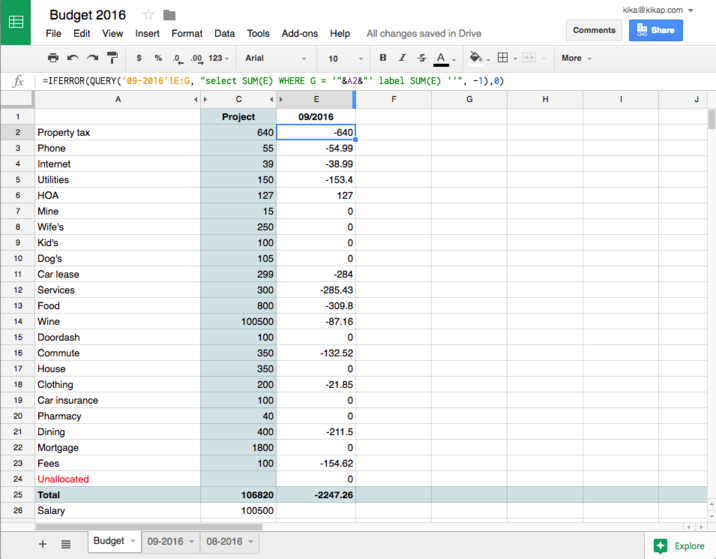

*(numbers were made up)*
Hacker Wallet
=============

A tool for Node.js programmers who do not trust Mint.com and similar sites. 

It allows you to keep track of your personal finances using just free Google Sheets and online banking, without trusting any third party sites with your banking passwords.

Your passwords are stored on your local hard drive and only the transaction amounts (dates, memos, etc) travel to Google Sheets.
It runs everywhere where Node.js runs, but I tested it only on OS/X and Node 6.5.0.

The code quality is a bit lacking, I threw it all together on weekend. But it works for me and users are happy.

How it works
-------------
It pulls the data from online banking in the industry standard format (OFX) using great [Banking.js](https://github.com/euforic/banking.js). See their site for configuration information. The configuration is stored in the `config.coffee` file, the sample is provided, copy it and edit.

The second part of the "solution" is the Google Sheets spreadsheet. You can copy [the one I use](https://docs.google.com/spreadsheets/d/1UVPZEttwS8SdRpJAU9u_2dR12NRYKcWWJoQ6HHaVCNQ/edit?usp=sharing) and hack it as necessary. 

The program creates a new sheet within this spreadsheet (the `09-2016` was created automatically) for every month of the year and then adds transactions for this month to this sheet, removing duplicates. Dedup is based on transaction reference numbers or transaction IDs. 

The first "main" sheet of the whole spreadsheet is used as an overall view of your budget broken down into categories. Categories are selected from monthly sheets based on the information in the column `G`. The exact names of the categories do not matter, just make sure that entries in the first column of the "main" sheet match the entries you put into the `G` column. You can put these values in the `G` column manually and/or use "artificial intelligence":

The module `lib/ai.coffee` (the name is a joke, of course) contains a `classify` function, which tries to determine the category of the transaction automatically based on transaction data. Hack away.

Some banks do not provide online access to OFX data (or charge an exorbitant fee or only allow such access for specific types of accounts) so you can either consider changing your bank or find a way to download OFX data as a file. This utility allows loading OFX data from files. 

A notable exception is the Synchrony Bank (former GE Money) which provides store cards for many offline and online retailers, including, unfortunately, Amazon. Amazon Store Card is a Synchrony Bank card and if you have such card you have no OFX data access whatsoever. This is Amazon, the company which basically became the synonym for word "online".

Installation
--------------
1. Make sure you have node and coffeescript installed
2. Checkout the project and install dependencies: `npm install`
1. Copy the `config.sample.coffee` to `config.coffee` and edit banking information according to the [Banking.js](https://github.com/euforic/banking.js) page.
1. Create a Google Sheets spreadsheet or copy mine and copy the spreadsheet ID to `config.coffee`. Spreadsheet ID is a long sequence of characters between `/d/` and `/edit` in the URL.
2. Now you need to register your script as an application with Google and authorize it to alter information in Google Sheets:
	* Perform actions listed in [Step 1](https://developers.google.com/sheets/quickstart/nodejs)
	* Run the application for the first time `npm run app` and it will ask you to visit some URL at Google and copy the code provided there. 
	* After you successfully complete these steps they will not be necessary going forward, the credentials and Oauth token are cached locally.

License
-----------
MIT

